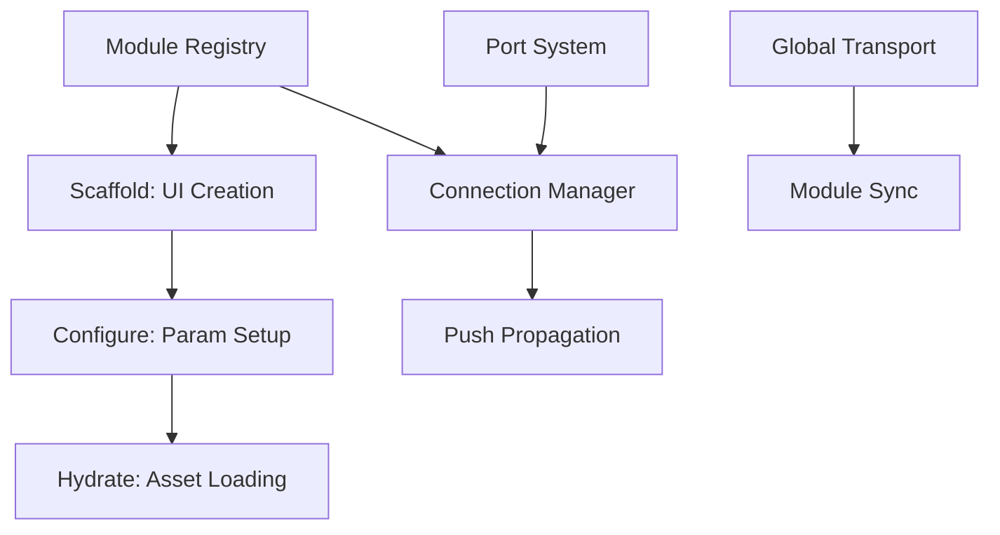

# Feature Landscape: Modular A/V Frameworks

**Domain:** Modular A/V Frameworks (Refactor)
**Researched:** 2026-01-28
**Overall confidence:** HIGH

## Table Stakes

Features users expect in any modern modular environment. Missing these makes the framework feel incomplete or fragile.

| Feature | Why Expected | Complexity | Notes |
|---------|--------------|------------|-------|
| **Unified Port System** | Users need a consistent way to connect Audio, Video, and Data. | High | Requires a robust base class and type-safe connection logic. |
| **JSON Serialization** | Essential for saving and sharing "patches" or sessions. | Medium | Must handle complex nested states and module-specific settings. |
| **Global Transport/Clock** | All sequencers and LFOs must stay in sync (BPM, phase). | Medium | Requires high-precision timing and event broadcasting. |
| **Dynamic Module Registry** | Ability to add/remove modules from a library at runtime. | Medium | Needs a factory pattern and dynamic library loading support. |
| **Parameter Mapping** | Any UI slider must be controllable via external signals (MIDI, LFO). | Medium | Needs a centralized Parameter Router with scaling/offset support. |

## Differentiators

Features that set a product apart and provide a "pro" workflow.

| Feature | Value Proposition | Complexity | Notes |
|---------|-------------------|------------|-------|
| **Immediate Push Propagation** | Minimizes latency and jitter in modulation. Updates travel "instantly" through the graph. | High | Requires topological sorting of the graph and optimized update paths (as seen in BespokeSynth). |
| **Lifecycle-Aware Hydration** | Separates "Scaffolding" (UI creation) from "Hydration" (heavy asset loading/activation). | High | Prevents GUI freezes when loading large video/audio files or complex shaders. |
| **Implicit Input Mixing** | Allows multiple cables into one port (Mixer behavior) without needing an explicit Mixer module. | Medium | Greatly simplifies graph layout for the user. |
| **Auto-Discovery Routing** | New modules "know" where to connect (e.g., Synth -> Master Mixer) based on capabilities. | Medium | Reduces repetitive setup tasks. |
| **Strict Thread Separation** | Engine processing (Audio/Video) is never blocked by GUI operations. | Very High | Uses lock-free queues for parameter and command passing. |

## Anti-Features

Common pitfalls or patterns to explicitly avoid.

| Anti-Feature | Why Avoid | What to Do Instead |
|--------------|-----------|-------------------|
| **Hard-coded Routing** | Prevents user flexibility and breaks serialization. | Use a dynamic `ConnectionManager` with UUID-based links. |
| **Blocking Load Calls** | Freezes the app during session loading or asset switching. | Use a background "Hydration" queue for non-critical assets. |
| **Global State Dependence** | Makes modules unpredictable and hard to test. | Ensure all data flows through input ports or parameters. |
| **Synchronous UI Callbacks** | Directly modifying data from a button click causes crashes. | Use a Command Queue for async communication. |

## Feature Dependencies

## Specialized Feature: Connection Lifecycle

To achieve a unified API, we follow a three-stage lifecycle for all modules:

1.  **Scaffold**:
    *   **Goal**: Create the "shell" of the module.
    *   **Scope**: Constructor call, Port declarations, UI object creation.
    *   **Requirement**: Must be extremely fast (O(1)) and non-blocking.

2.  **Configure**:
    *   **Goal**: Apply persistent state.
    *   **Scope**: `fromJson()`, parameter assignment, link discovery.
    *   **Requirement**: No hardware access or file I/O yet.

3.  **Hydrate**:
    *   **Goal**: Activate the module logic.
    *   **Scope**: File loading, GPU buffer allocation, event subscriptions.
    *   **Requirement**: Performed asynchronously if heavy; triggers "Ready" state.

## Specialized Feature: Push Propagation

Modern frameworks (like BespokeSynth) prioritize "Push" over "Pull" for modulation:
- **Immediate Propagation**: When an LFO value changes, it calls `setParameter` on all connected modules immediately.
- **Topological Sorting**: The graph is sorted so that modules are updated in order of dependency, preventing "one-frame-behind" lag.
- **Feedback Protection**: A `syncing` flag or recursion depth check is used to prevent infinite loops in cyclic graphs.

## MVP Recommendation for Refactor

For the upcoming refactor, prioritize:
1.  **Unified Port System**: Ensure Audio/Video/Event ports follow the same `Port` interface.
2.  **Explicit Lifecycle**: Implementation of `initialize()` across all modules to handle "Hydration".
3.  **Push Propagation**: Optimize `ParameterRouter` and `EventRouter` to ensure immediate propagation without feedback loops.

## Sources

- [BespokeSynth Architecture](https://github.com/BespokeSynth/BespokeSynth) - High confidence
- [Mosaic (ofxVisualProgramming)](https://github.com/d3cod3/Mosaic) - Medium confidence
- Existing `videoTracker` source code - High confidence
